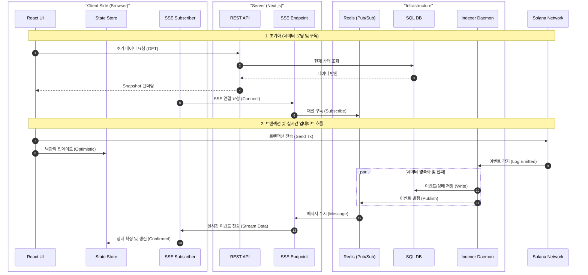

# [Final Spec] Confidential State 확장 및 실시간 이벤트 시스템

## 1\. 아키텍처 결정 사항 (Architecture Decision Record)

### 1.1 핵심 구조 변경

  * **Indexer 분리 (Standalone Daemon):** 기존 Next.js 내부 로직에서 분리하여 Node.js 독립 프로세스로 구동 (`scripts/run-indexer.ts` 활용).
  * **Event Bus 도입 (Redis Pub/Sub):** Indexer와 API 서버 간의 디커플링 및 멀티 인스턴스/Serverless 환경 대응.
  * **Hybrid Data Sync:**
      * **Cold Start:** DB 조회 (REST API)
      * **Live Update:** Redis Pub/Sub → SSE (Server-Sent Events)

### 1.2 기술 스택 확정

  * **Runtime:** Node.js (Indexer), Next.js (API/Frontend)
  * **Database:** PostgreSQL (영구 저장), Redis (메시지 브로커 및 캐시)
  * **State Management:** React Query + Local Store (Optimistic Update 지원)

### 1.3 시스템 흐름도 (Sequence Diagram)

전체 시스템의 데이터 흐름과 컴포넌트 간 상호작용을 시각화합니다.



-----

## 2\. 상세 구현 명세 (Implementation Specs)

### 2.1 Redis 채널 설계 (Pub/Sub)

데이터의 세분화된 구독을 위해 채널을 계층적으로 설계합니다.

| 채널명 | 용도 | 구독 대상 |
| :--- | :--- | :--- |
| `channel:global_events` | 시스템 전체 공지/이벤트 | 모든 접속 클라이언트 |
| `channel:user:{wallet_address}` | 특정 유저의 자산/상태 변경 | 해당 지갑 소유자 |
| `channel:handle:{handle_hash}` | 특정 Handle의 상태 변경 (심화) | 해당 Handle을 보고 있는 컴포넌트 |
| `channel:operation:{op_type}` | 특정 연산 타입 (디버깅/모니터링) | 관리자 대시보드 |

### 2.2 Gap Filling 로직 (SSE 연결 보정)

네트워크 불안정으로 인한 재연결 시 데이터 유실을 방지하는 알고리즘입니다.

```typescript
// SSE API Endpoint Logic
export async function GET(req: Request) {
  const lastEventId = req.headers.get('Last-Event-ID');
  const sinceBlock = req.url.searchParams.get('since');

  // 우선순위 로직
  // 1. Last-Event-ID가 있으면: 해당 ID 이후의 이벤트를 DB/Cache에서 조회
  // 2. sinceBlock이 있으면: 해당 블록 높이 이후의 이벤트를 조회
  // 3. 둘 다 없으면: 최신 상태만 구독 시작

  // Gap 데이터 전송 후 실시간 스트림으로 전환
}
```

### 2.3 클라이언트 상태 관리 (Optimistic UI & Rollback)

`handle-utils.ts`를 활용한 예측 실행과 실패 시 복구 전략입니다.

```typescript
interface ConfidentialStateItem {
  handle: string;
  data: string | null;
  status: 'optimistic' | 'confirmed' | 'failed';
  txSignature?: string;
  timeoutId?: number; // 롤백 타이머 ID
}

// Action: 트랜잭션 전송 시
// 1. deriveBinaryHandle() 등으로 결과 예측 -> 'optimistic' 상태로 UI 추가
// 2. 30초 타임아웃 설정 (시간 내 이벤트 미수신 시 'failed' 처리 및 롤백)
// 3. SSE로 Confirmed 이벤트 수신 시 -> 'confirmed' 확정 및 타이머 해제
```

-----

## 3\. 마이그레이션 로드맵 (Phased Rollout)

Cursor가 제안한 **점진적 전환 전략**을 채택하여 서비스 중단을 방지합니다.

### Phase 1: 기반 인프라 준비 (Infrastructure)

  * [ ] Redis 인스턴스 및 Pub/Sub 연결 설정.
  * [ ] Indexer 로직에서 DB 저장 직후 Redis Publish 코드 추가.
  * [ ] `scripts/run-indexer.ts`를 독립 실행 가능한 데몬 형태로 고도화.

### Phase 1.5: 하이브리드 운영 (Hybrid Mode)

  * [ ] **Feature Flag 도입:** `INDEXER_MODE='standalone' | 'integrated'`
  * [ ] 로컬 개발은 편의상 'integrated' 유지, 스테이징/프로덕션은 'standalone'으로 분리 배포 테스트.
  * [ ] 기존 Polling 방식과 신규 SSE 방식을 잠시 병행할 수도 있음.

### Phase 2: 서버 사이드 구현 (Backend)

  * [ ] SSE 엔드포인트 (`/api/events/stream`) 구현.
  * [ ] Indexer Health Check (`/health`) 및 Redis 연결 실패 시 Fallback(DB Polling) 로직 추가.

### Phase 3: 클라이언트 연동 (Frontend)

  * [ ] `useEventSubscription` 훅 구현 (자동 재연결, Back-off 포함).
  * [ ] Confidential State Store 리팩토링 (Map 구조, 의존성 그래프).
  * [ ] UI 컴포넌트에 낙관적 업데이트 적용.

-----

## 4\. 운영 및 리스크 관리 (Ops Strategy)

### 4.1 Serverless 한계 극복 (Vercel)

  * **문제:** Vercel 함수는 최대 실행 시간 제한이 있어 SSE 연결이 주기적으로 끊김.
  * **해결:**
      * 클라이언트 `useEventSubscription` 훅에서 연결 끊김을 감지하면 즉시 재연결(Re-connect) 하도록 구현.
      * 서버는 15\~30초마다 `keep-alive` 주석(comment) 패킷 전송.

### 4.2 모니터링 포인트

  * **Indexer Liveness:** 데몬이 죽지 않았는지 프로세스 감시 (PM2/Docker Healthcheck).
  * **Event Lag:** (현재 블록 높이 - 인덱싱된 블록 높이)가 커지면 알림.
  * **Redis Memory:** 미사용 채널이나 오래된 키가 쌓이지 않도록 TTL 설정 확인.

-----

## 5\. 최종 요약

이 계획은 기존 코드베이스(`handle-utils.ts`, `indexer.ts`, `CiphertextStore`)를 최대한 재활용하면서, 아키텍처의 약점(Stateful 연결 부재, Serverless 제약)을 보완하는 방향입니다.

**바로 진행해야 할 Next Action:**

1.  **Redis Pub/Sub 클라이언트** (`src/lib/redis/pubsub.ts`) 작성.
2.  **Indexer에 Publish 로직** 주입.
3.  **Phase 1.5(하이브리드 모드)** 설정을 위한 환경변수 및 진입점 분리.

```
classDiagram
    direction TB
    
    %% 1. Client Side
    namespace Zustand {
        class ConfidentialStateStore {
            +Map items
            +addOptimistic()
            +confirm()
            +rollback()
        }

        class ClientStateItem {
            +String handle
            +String status 
            +String? client_tag
            +String? encryptedData
            +String? txSignature
            +Number? timeoutId
        }
    }

    %% 2. Redis / Cache
    namespace Upstash {
        class PubSub_Channel {
            +String global_events
            +String user_wallet
        }

        class Pending_Upload {
            %% TTL: 1h
            +String handle
            +String encryptedData
        }
    }

    %% 3. Database
    namespace PostgreSQL {
        class Ciphertext {
            +String handle (PK)
            +String owner
            +String data
            +String status
        }

        class HandleDependency {
            +String id (PK)
            +String outputHandleId
            +String[] inputHandles
            +String operation
        }

        class EventStream {
            +String eventId (Unique)
            +String eventType
            +Json payload
        }
    }

    %% Relationships
    ClientStateItem ..> Pending_Upload : 1. Upload
    Pending_Upload ..> Ciphertext : 2. Commit
    Ciphertext -- HandleDependency : Lineage
    
    Ciphertext ..> PubSub_Channel : 3. Publish
    PubSub_Channel ..> ClientStateItem : 4. SSE Update
    
    EventStream ..> ClientStateItem : 5. Gap Filling
```

```
erDiagram
    direction TB

    Ciphertext {
        string handle PK "Ciphertext handle (32 bytes Hex)"
        string owner "Wallet Address or PDA"
        string data "Base64 encrypted data"
        string clientTag
        string status "active or consumed"
        string originSignature
        datetime createdAt
        datetime updatedAt
    }

    HandleDependency {
        string id PK
        string outputHandleId UK
        string[] inputHandles "Handles (String[])"
        string operation "ADD, SUB, etc."
        string operationType "Unary, Binary, etc."
        string signature
        bigint slot
        datetime createdAt
    }

    EventStream {
        string id PK
        string eventId UK
        string eventType
        string targetOwner
        json payload
        string signature
        bigint slot
        datetime createdAt
    }

    IndexerState {
        string programId PK
        bigint lastSlot
        string lastSignature
        datetime updatedAt
    }

    Ciphertext ||--o| HandleDependency : "has dependency"
    HandleDependency ||--|| Ciphertext : "output (outputHandleId)"

```

```
erDiagram
    direction TB

    %% 1. 임시 저장소 (Staging)
    RedisPendingUpload {
        string key PK "pending:{handle}"
        string handle
        string encryptedData "Base64"
        string owner
        int ttl "3600s (Auto Expire)"
        timestamp createdAt
    }

    %% 2. 실시간 메시지 (Transport)
    RedisPubSubMessage {
        string channel PK "channel:user:{wallet}"
        string eventId
        string eventType
        string targetOwner
        json payload "Contains Handle & Status"
        timestamp publishedAt
    }
```

```
erDiagram
    direction TB

    %% Global Store State
    ConfidentialStateStore {
        Map items "Key: Handle, Value: Item"
        Map dependencyGraph "Key: Result, Value: Inputs[]"
    }

    %% Individual Item State
    ClientStateItem {
        string handle PK
        string owner
        string data "Nullable (if pending)"
        
        %% UI 전용 상태 필드
        string status "optimistic | confirmed | failed"
        string txSignature "Local Tracking"
        string predictedHandle "Local Calc Result"
        number timeoutId "Rollback Timer ID"
        
        timestamp createdAt
    }

    %% Relationship
    ConfidentialStateStore ||--o{ ClientStateItem : "manages"
```